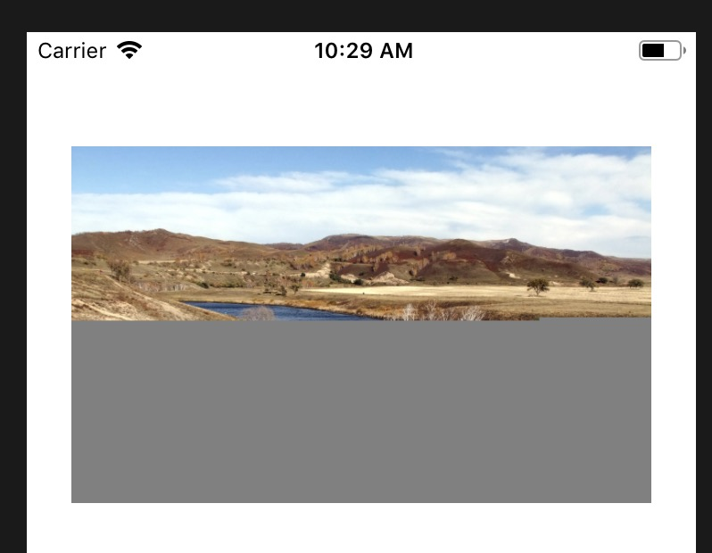

## rn-img-cache
First, this project is improved from [react-native-img-cache](https://github.com/wcandillon/react-native-img-cache). Honestly, [react-native-img-cache](https://github.com/wcandillon/react-native-img-cache) is very easy to use, but I didn't found it verify whether the file  correct in my real worikng situation, so sometimes we just could see a part of a image(kill the app process when downloading the image).So I modified the code to create a temp file when downloading, and made it right after the downloading was done. It's just so easy.
### showcases

#### incomplete image



#### real origin image

[show the origin image](https://img.pconline.com.cn/images/upload/upc/tx/photoblog/1210/01/c1/14222204_14222204_1349049772031.jpg")


### install

react-native install rn-img-cache<br>
or<br>
npm install rn-img-cache

### usages

```js
import {CachedImage} from "rn-img-cache";
<CachedImage style={[{
        height: 100,
        width: 100,
	}]}
source={{uri: "https://img.jpg"}}/>
```

---

首先，该项目是在[react-native-img-cache](https://github.com/wcandillon/react-native-img-cache)的基础上修改的。[react-native-img-cache](https://github.com/wcandillon/react-native-img-cache)很好用，但是在实际使用过程中我发现它采取的下载机制没有对下载的内容做一个完整性的校验，这就导致图片可能只下载了一半(比如中途杀进程)而无法显示完整。我本来打算着手根据http的content-length来判断下下载内容是否完整，但是发现它内部的[RNFetchBlob](https://github.com/joltup/rn-fetch-blob)并没有抛出回调，我打算从js端着手，思路很简单，就是在下载的时候给文件一个临时名称，当下载完成后再修改回来，这样唯一的坏处就是之前下了一部分的不完整图片浪费掉了，但是我觉得这个影响完全可以忽略。
### 示例

#### 不完整显示


#### 实际图片


### 安装

react-native install rn-img-cache<br>
or<br>
npm install rn-img-cache

### 使用方式

直接下载引用即可

```js
import {CachedImage}  from "rn-img-cache";
<CachedImage style={[{
        height: 100,
        width: 100,
	}]}
source={{uri: "https://img.jpg"}}/>
```
